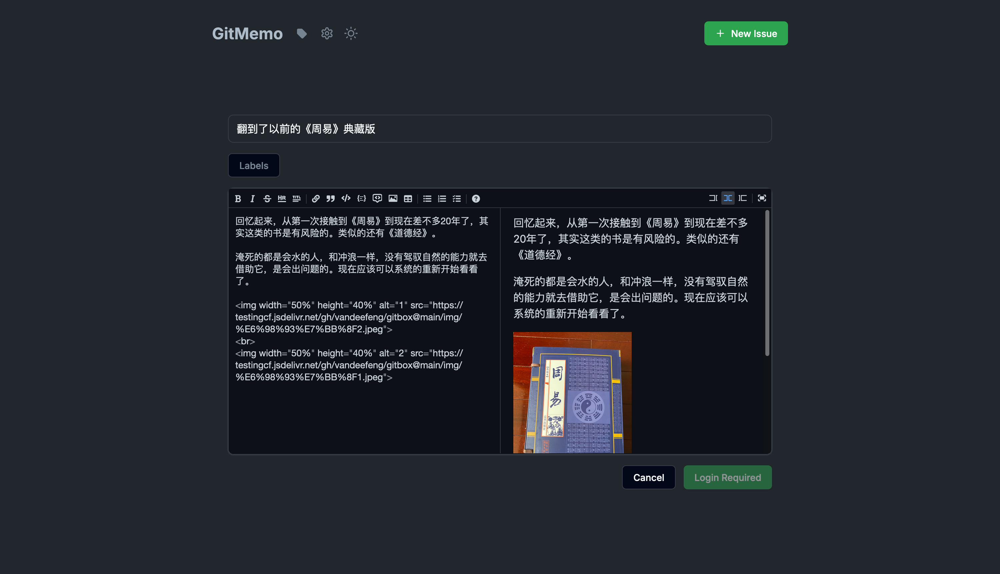
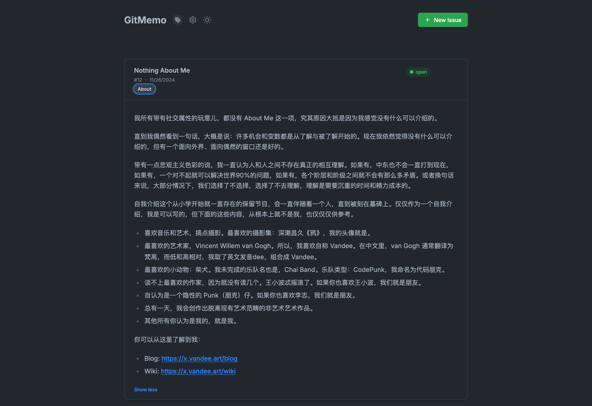
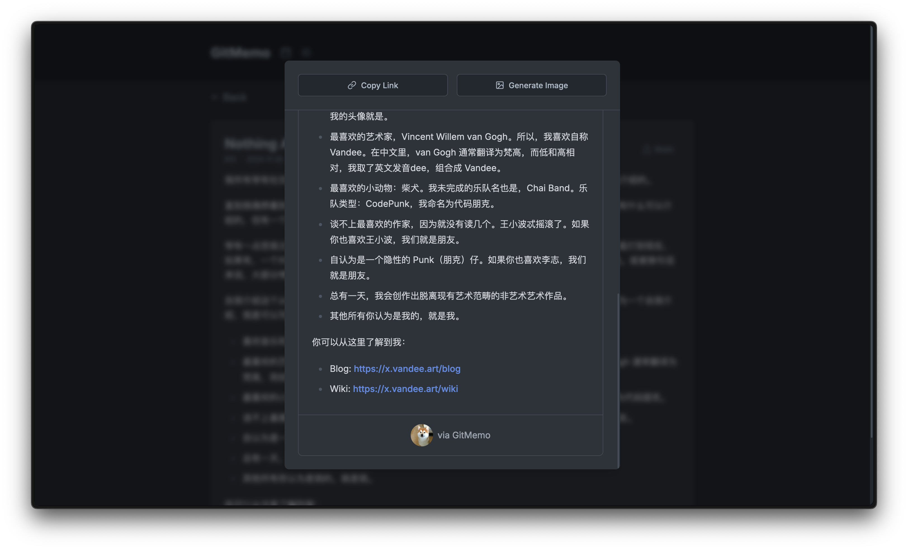

# GitMemos

一个基于 GitHub Issues 的 Memos 替代。配合 [VandeeFeng/gitmemo](https://github.com/VandeeFeng/gitmemo)，提供一个简单的页面。

代码由 cursor 协助生成。

由于 Memos 总是不太稳定，而 GitHub Issues 基本上可以满足我所有记录 Memos 的需求，因此做了这个页面。

部署到 Vercel 时填写必要的环境变量即可默认显示自己仓库的 issues 数据。

如果想显示其他仓库，现在只是提供了一个 简单的 GitHub Config 来配置仓库和 API，数据保存在 supabase 中。会优先获取环境变量的账号数据，具体的登录功能没有继续往下了。







## 技术栈

- Framework: Next.js 13+ (App Router)
- UI: Tailwind CSS
- UI: shadcn/ui
- Language: TypeScript
- Database: Supabase
- Backend: GitHub API
- Deploy: Vercel

## 主要功能

- 📝 基于 GitHub Issues 的笔记管理
- 📝 基于 Supabase 的数据库
- 🔄 同步 GitHub Issues 数据
- 🎨 支持亮色/暗色主题
- ✨ Markdown 编辑和实时预览
- 🏷️ 标签管理和筛选
- 🔗 反链
- 📤 卡片分享

## 快速开始

1. 克隆仓库并安装依赖：
   ```bash
   git clone git@github.com:VandeeFeng/gitmemos.git
   cd gitmemos
   npm install
   ```

2. 配置环境变量：
   复制 `.env.example` 到 `.env.local` 并配置以下环境变量：

   ### GitHub 配置
   - `GITHUB_TOKEN`: GitHub 个人访问令牌
   - `GITHUB_OWNER`: GitHub 用户名
   - `GITHUB_REPO`: GitHub 仓库名
   - `GITHUB_WEBHOOK_SECRET`: GitHub webhook 密钥（可选）

   ### Supabase 配置
   - `NEXT_PUBLIC_SUPABASE_URL`: Supabase 项目 URL
   - `NEXT_PUBLIC_SUPABASE_ANON_KEY`: Supabase 匿名密钥
   - `SUPABASE_SERVICE_ROLE_KEY`: Supabase 服务角色密钥

   ### 应用配置
   - `NEXT_PUBLIC_APP_URL`: 应用访问地址
     - 开发环境: `http://localhost:3000`
     - 生产环境: 实际域名（如 `https://your-app-url.com`）

3. 启动开发服务器：
   ```bash
   npm run dev
   ```

## GitHub 配置
### GitHub Token 设置

1. 访问仓库，点击 `Settings` -> `Developer settings` -> `Personal access tokens` -> `Generate new token`
2. 生成新的 token，找到仓库，勾选 `issue` 读写权限
3. 将 token 添加到 `.env.local` 文件中

### GitHub webhook 设置
1. 访问仓库，点击 `Settings` -> `Webhooks` -> `Add webhook`
2. 填写 `Payload URL` 为 `https://your-vercel-app-url/api/webhook/github`
3. 选择 `Content type` 为 `application/json`
4. 选择 `Secret` 为 `your_secret_key`，这个 secret 需要和 `.env.local`的`GITHUB_WEBHOOK_SECRET` 的 secret 一致
5. 选择 `Which events would you like to trigger this webhook?` 为 `Issues`、`Labels`
6. 点击 `Add webhook`

## Supabase 设置
参考 [docs/supabase_init.md](./docs/supabase_init.md)

在 supabase 里有四个表，分别是 configs, issues, labels, sync_history

configs 表是用来存储用户配置的，包括 owner, repo, password

issues 表是用来存储 issues 的，包括 owner, repo, issue_number, title, body, state, labels, github_created_at, updated_at, created_at

labels 表是用来存储 labels 的，包括 owner, repo, name, color, description, updated_at, created_at

sync_history 表是用来存储同步历史的，包括 owner, repo, last_sync_at, issues_synced, status, error_message, created_at, updated_at

这部分可以根据自己的需求进行修改，比如添加更多的字段，或者修改表结构。

## 安全说明

- 所有敏感 API 调用都经过来源验证
- 带有 `NEXT_PUBLIC_` 前缀的环境变量在浏览器中可访问
- 请确保 `.env.local` 文件的安全，永远不要将其提交到版本控制系统中

## TODO
- [x] 搜索功能 
- [x] 数据库
- [x] 登录功能
- [x] TimeLine
- [x] 分享功能
- [x] 实时更新，配置了GitHub webhook
- [x] 移动端适配
- [x] 优化数据处理
- [ ] AI 功能
